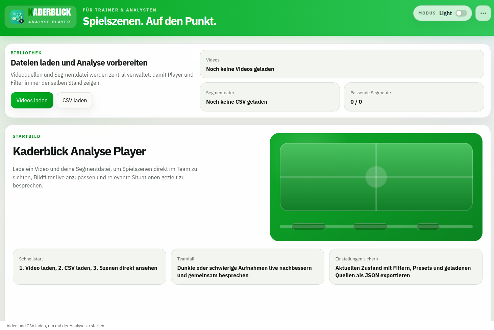

# Kaderblick Analyse Player

Desktop-Anwendung für die Fußball-Videoanalyse – CSV-basierte Szenennavigation, Echtzeit-Bildfilter und Presets für schwierige Aufnahmen.



---

## Funktionsübersicht

| Funktion | Beschreibung |
|---|---|
| **Segmentnavigation** | CSV-Datei laden, Szenen werden automatisch dem Video zugeordnet |
| **Segmentmodus** | Nur markierte Szenen hintereinander abspielen |
| **Einzelwiederholung** | Aktive Szene in Schleife |
| **Live-Filter** | Helligkeit, Kontrast, Sättigung, Weichzeichner – in Echtzeit während der Wiedergabe |
| **Presets** | Filtereinstellungen speichern, laden, importieren und exportieren |
| **Session-Wiederherstellung** | Geladene Videos, CSV und Einstellungen als JSON exportieren und später wieder laden |
| **Tastatursteuerung** | Vollständige Bedienung ohne Maus |

---

## Tastaturkürzel

| Taste | Funktion |
|---|---|
| `Leertaste` | Wiedergabe / Pause |
| `N` | Segmentmodus ein-/ausschalten |
| `R` | Einzelwiederholung ein-/ausschalten |
| `F` | Filterbereich ein-/ausblenden |
| `Pfeil links` | Voriges Segment |
| `Pfeil rechts` | Nächstes Segment |
| `F11` | Vollbild |

---

## Voraussetzungen

- **Node.js** ≥ 18
- **npm** ≥ 9

---

## Installation & Entwicklung

```bash
# Abhängigkeiten installieren
npm install

# Entwicklungsmodus starten (Hot Reload)
npm run dev

# Tests ausführen
npm test

# Tests im Watch-Modus
npm run test:watch

# TypeScript-Typen prüfen
npm run lint
```

---

## Build & Release

```bash
# Produktions-Build + Installer erstellen
npm run build

# Nur die entpackte App bauen (schneller, kein Installer)
npm run build:dir
```

Der Build erzeugt Pakete für:

- **Linux** – AppImage + .deb
- **Windows** – NSIS-Installer + Portable
- **macOS** – DMG + ZIP

Ausgabe landet im Verzeichnis `release/`.

Releases werden über [semantic-release](https://semantic-release.gitbook.io/) automatisiert:

```bash
# Dry-Run (kein tatsächlicher Release)
npm run release:dry-run

# Release veröffentlichen
npm run release
```

Commit-Nachrichten müssen dem [Conventional Commits](https://www.conventionalcommits.org/)-Standard folgen.

---

## Projektstruktur

```
src/
  common/       # Shared-Logik (Segmente, Filter, Typen, Tests)
  main/         # Electron-Hauptprozess (Dateidialoge, FFprobe, Streaming)
  preload/      # IPC-Bridge (contextBridge API)
  renderer/     # React-Frontend (UI, Hooks, Feature-Komponenten)
assets/         # App-Icons und Schriften
docs/           # Benutzerhandbuch und technische Architektur
release/        # Build-Ausgabe (wird generiert)
```

---

## Technischer Stack

| Schicht | Technologie |
|---|---|
| Desktop-Framework | Electron 37 |
| Frontend | React 19, TypeScript 5 |
| Build | electron-vite, Vite 7 |
| Medienverarbeitung | ffmpeg-static, ffprobe-static |
| CSV-Parsing | PapaParse |
| Tests | Vitest 3, @testing-library/react |
| Release | semantic-release |

---

## Dokumentation

- [Benutzerhandbuch](docs/benutzerhandbuch.md)
- [Technische Architektur](docs/technical-architecture.md)
- [Changelog](CHANGELOG.md)

---

## Lizenz

Proprietär – alle Rechte vorbehalten.  
Kontakt: Andreas Kempe &lt;andreas.kempe@byte-artist.de&gt;  
Projektseite: [kaderblick.de](https://kaderblick.de)
